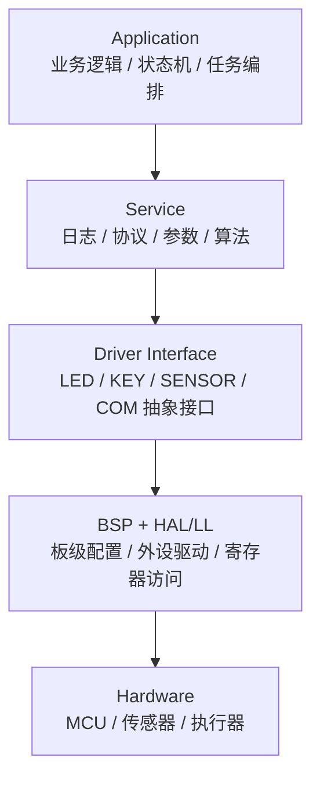
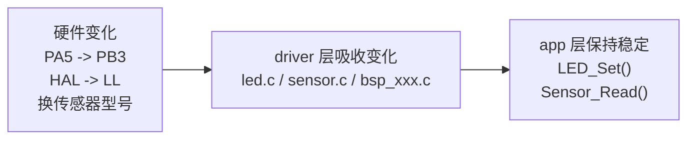
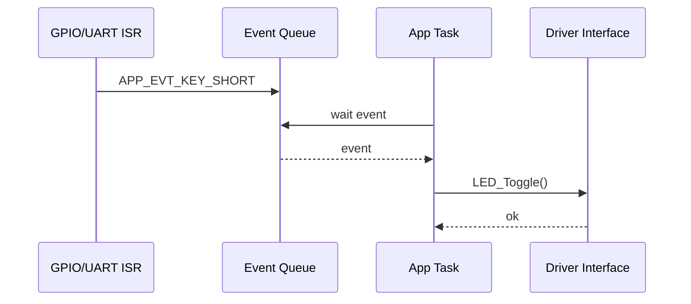

我以前写 STM32 小 demo，最喜欢的结构就是一个 `main.c` 打天下。

初始化 GPIO、串口、定时器，然后在 `while (1)` 里读按键、翻转 LED、打印日志。能跑，现象也对，看起来没什么问题。

最近整理 STM32N647 相关的端侧项目资料时，我又想起这个问题。端侧项目很容易从“先把功能跑起来”开始，但后面一旦接上传感器、串口协议、数据处理、模型推理和低功耗，代码结构就会变得很敏感。

这类代码有个很隐蔽的坑：项目小的时候很爽，项目稍微一变大，就开始谁也不敢改。

这篇不是想把“嵌入式软件架构”讲成很玄的东西。我更想记录一个朴素的理解：

> 架构不是为了把代码写复杂，而是为了让未来的改动不扩散。

### main.c 长不可怕，边界没了才可怕

一个很常见的按键点灯 demo，大概长这样：

```c
int main(void)
{
    HAL_Init();
    MX_GPIO_Init();
    MX_USART1_UART_Init();

    while (1) {
        if (HAL_GPIO_ReadPin(KEY_GPIO_Port, KEY_Pin) == GPIO_PIN_RESET) {
            HAL_Delay(20);
            if (HAL_GPIO_ReadPin(KEY_GPIO_Port, KEY_Pin) == GPIO_PIN_RESET) {
                HAL_GPIO_TogglePin(LED_GPIO_Port, LED_Pin);
                printf("key pressed\r\n");
            }
        }
    }
}
```

这段代码不是不能用。

真正的问题是，它把几件完全不同的事揉在了一起：GPIO 读写、按键去抖、LED 状态变化、串口输出，还有“按下按键后应该做什么”这条业务规则。

现在只改 LED 引脚，还能忍。后面如果要加长按、双击、低功耗、串口协议、传感器采样，再上一个 FreeRTOS，这个 `while (1)` 很快就会变成一坨状态和 flag。

到了那一步，痛点不是“代码不够优雅”。

痛点是每次改需求，都不知道会不会把别的地方带崩。

### 架构不是目录树，是依赖关系

我以前也有个误解：以为把工程拆成 `app/`、`drivers/`、`bsp/`，就算有架构了。

后来发现不是。

如果 `app.c` 里到处都是 `HAL_GPIO_WritePin()`，如果每个模块都 `extern` 别人的全局变量，如果中断里直接改业务状态，那么目录分得再漂亮也只是摆设。

我现在更愿意先画依赖关系：



这个图不一定适合所有项目，但它提醒我一件事：上层可以调用下层，下层不要反过来知道太多上层业务。

换句话说，业务层应该关心“LED 要不要亮”，不应该关心“哪个 GPIO 输出高电平”。

### HAL 是硬件抽象，不是业务抽象

很多 STM32 项目都会用 HAL。HAL 本身没问题，ST 的文档也把它定位在外设驱动层：偏易用、偏可移植，适合处理常见外设流程。LL 则更贴近寄存器，更适合对性能、时序、代码体积敏感的地方。

但我觉得关键不是 HAL 和 LL 谁更高级。

关键是业务层别直接碰它们。

比如应用层要点灯，我希望它写：

```c
LED_Set(true);
```

而不是：

```c
HAL_GPIO_WritePin(GPIOA, GPIO_PIN_5, GPIO_PIN_SET);
```

`led.c` 里面可以继续用 HAL：

```c
void LED_Set(bool on)
{
    HAL_GPIO_WritePin(LED_GPIO_Port, LED_Pin,
                      on ? GPIO_PIN_SET : GPIO_PIN_RESET);
}
```

以后如果 LED 从 `PA5` 换到 `PB3`，或者我决定把底层改成 LL，改动应该停在 `led.c`。

这就是“隔离变化”。



### 模块应该输出语义，而不是输出电平

按键模块也一样。

我不太喜欢让应用层直接读 GPIO 电平，然后自己判断短按、长按、去抖。因为这样一来，应用层就被迫知道太多硬件细节。

更好的方式是让 `key` 模块输出事件：

```c
typedef enum {
    KEY_EVENT_NONE = 0,
    KEY_EVENT_SHORT,
    KEY_EVENT_LONG,
} KeyEvent;

void KEY_Init(void);
KeyEvent KEY_PollEvent(void);
```

应用层只处理业务：

```c
void App_RunOnce(void)
{
    KeyEvent event = KEY_PollEvent();

    switch (event) {
    case KEY_EVENT_SHORT:
        LED_Toggle();
        break;
    case KEY_EVENT_LONG:
        LED_Set(false);
        break;
    default:
        break;
    }
}
```

这里的重点是“语义上移”。

应用层不关心“按键引脚现在是不是低电平”，它关心的是“用户短按了一次”。

### 不上 RTOS，也可以有结构

架构不等于必须上 FreeRTOS。

简单项目用 super loop 完全可以，只要边界清楚。比如一个不用 RTOS 的最小结构可以是：

```text
Project/
├── app/
│   ├── app.c
│   └── app.h
├── drivers/
│   ├── led.c
│   ├── led.h
│   ├── key.c
│   └── key.h
├── bsp/
│   ├── bsp_gpio.c
│   └── bsp_gpio.h
└── main.c
```

`main.c` 只负责启动：

```c
int main(void)
{
    HAL_Init();
    BSP_Init();
    App_Init();

    while (1) {
        App_RunOnce();
    }
}
```

这个结构没有多高级，但已经比所有东西塞进 `main.c` 好很多。

因为你至少能看出来：`app` 管业务，`drivers` 管设备能力，`bsp` 管板级硬件配置。

### 上了 RTOS，事件边界更重要

如果项目里开始有多个节奏，比如串口收包、传感器采样、屏幕刷新、按键输入、网络通信，那么 RTOS 就会自然很多。

但上 RTOS 以后，最容易犯的错是把复杂业务塞进中断里，或者到处用 flag 通知状态。

我现在更倾向于用事件表达系统行为：

```c
typedef enum {
    APP_EVT_KEY_SHORT = 1,
    APP_EVT_KEY_LONG,
    APP_EVT_UART_RX,
} AppEventType;

typedef struct {
    AppEventType type;
    uint32_t data;
} AppEvent;
```

中断里只投递事件：

```c
void HAL_GPIO_EXTI_Callback(uint16_t GPIO_Pin)
{
    BaseType_t higherPriorityTaskWoken = pdFALSE;

    if (GPIO_Pin == KEY_Pin) {
        AppEvent evt = {
            .type = APP_EVT_KEY_SHORT,
            .data = 0,
        };

        xQueueSendFromISR(app_event_queue, &evt, &higherPriorityTaskWoken);
        portYIELD_FROM_ISR(higherPriorityTaskWoken);
    }
}
```

业务 task 处理事件：

```c
void AppTask(void *argument)
{
    AppEvent evt;

    for (;;) {
        if (xQueueReceive(app_event_queue, &evt, portMAX_DELAY) == pdPASS) {
            switch (evt.type) {
            case APP_EVT_KEY_SHORT:
                LED_Toggle();
                Log_Info("key short press");
                break;
            case APP_EVT_KEY_LONG:
                LED_Set(false);
                break;
            default:
                break;
            }
        }
    }
}
```

这里有个血泪教训：ISR 里不要 `printf`，也不要做复杂状态机。

ISR 负责报告“发生了什么”，task 负责决定“接下来做什么”。



### 抽象不是炫技，是为了换东西时少改代码

传感器接口也很适合说明这个问题。

假设项目里现在用 SHT30，后面可能换成 AHT20。如果应用层到处写 SHT30 的寄存器和 I2C 细节，换型号时会很痛苦。

可以先定义一个很薄的接口：

```c
typedef struct {
    float temperature;
    float humidity;
} SensorData;

typedef struct SensorDriver {
    bool (*init)(void);
    bool (*read)(SensorData *out);
} SensorDriver;
```

具体型号自己实现：

```c
static bool SHT30_Read(SensorData *out)
{
    // read raw data and convert
    out->temperature = 25.0f;
    out->humidity = 50.0f;
    return true;
}

const SensorDriver g_sht30_driver = {
    .init = SHT30_Init,
    .read = SHT30_Read,
};
```

应用层只依赖抽象接口：

```c
static const SensorDriver *sensor = &g_sht30_driver;

void App_ReadSensor(void)
{
    SensorData data;
    if (sensor->read(&data)) {
        Log_Info("temp=%.1f hum=%.1f", data.temperature, data.humidity);
    }
}
```

这个写法不一定每个小项目都需要。但当你知道传感器型号可能会换，或者同一套业务要跑在不同板子上，它就很值。

### 成熟生态其实都在做同一件事

这个思路不是我自己拍脑袋想出来的。

STM32Cube 的示例架构会把 infrastructure、use-case、resources 分开；CMSIS 提供 startup、system、device header 这些 Cortex-M 生态里的基础约定；Zephyr 用 devicetree 描述硬件，用 device model 管驱动；FreeRTOS 和 CMSIS-RTOS2 都提供 queue、task notification、event flags 这些事件通信手段。

再往大了看，NASA 的 cFS 也强调 platform-independent、layered architecture、component-based design 和 OS abstraction layer。

这些系统复杂程度差很多，但方向很像：

```text
把应用从具体硬件、具体 OS、具体板级配置里解耦出来。
```

所以分层、接口、事件驱动不是为了显得专业。

真正复杂的嵌入式系统，反而更依赖这些东西。

### 我会怎么练

如果要把这套东西练一遍，我不会一上来写什么大框架。

我会只做一个最小项目：

```text
按键 -> LED -> 串口上报
```

然后强迫自己遵守几条规则：

- `main.c` 只初始化和启动调度。
- `app.c` 不能直接调用 `HAL_GPIO_WritePin()`。
- `key.c` 输出事件，不输出 GPIO 电平。
- ISR 只投递事件，不处理业务。
- 每个模块先写 `.h`，再写 `.c`。
- 每加一个功能，都回头看修改范围有没有扩散。

如果后面把 LED 引脚从 `PA5` 换到 `PB3`，只需要改 `led.c` 或 BSP 配置，那说明方向是对的。

如果加 OLED 显示 LED 状态，只需要新增 `display` 模块，然后让 app 多调用一个接口，也说明边界还算清楚。

### 写在最后

我现在对嵌入式软件架构的理解很简单：

它不是让代码看起来像大厂项目，也不是一上来就造一堆抽象层。

它是在项目还小的时候，就提前想清楚哪些东西以后可能会变，然后把这些变化关在合适的位置。

小项目可以不用 RTOS，可以不用复杂框架，但不能没有边界。

后面再写 STM32 或端侧设备项目，我会先给自己定几条硬约束：

```text
main.c 只做初始化和启动调度。
app 层只写业务规则，不直接碰 HAL/LL。
driver 层吸收硬件变化，对外暴露稳定接口。
key/sensor/uart 这类模块输出语义，不输出硬件细节。
ISR 只报告事件，业务 task 或主循环处理事件。
每加一个功能，都检查修改范围有没有扩散。
```

先做到这些，`main.c` 至少不会那么快变成一块谁也不敢碰的地方。

### 参考资料

- [STM32Cube HAL2 architecture](https://dev.st.com/stm32cube-docs/embedded-software/2.0.0/en/architecture/hal2-architecture.html)
- [STM32Cube example architecture](https://dev.st.com/stm32cube-docs/examples/1.0.0-beta.1.0/docs/markup/porting/example-architecture.html)
- [CMSIS Introduction](https://arm-software.github.io/CMSIS_5/General/html/index.html)
- [Zephyr Device Driver Model](https://docs.zephyrproject.org/latest/kernel/drivers/index.html)
- [FreeRTOS Queues](https://www.freertos.org/Documentation/02-Kernel/02-Kernel-features/02-Queues-mutexes-and-semaphores/01-Queues)
- [CMSIS-RTOS2 Event Flags](https://arm-software.github.io/CMSIS_5/RTOS2/html/group__CMSIS__RTOS__EventFlags.html)
- [NASA Core Flight Software](https://etd.gsfc.nasa.gov/capabilities/capabilities-listing/cfs/)
