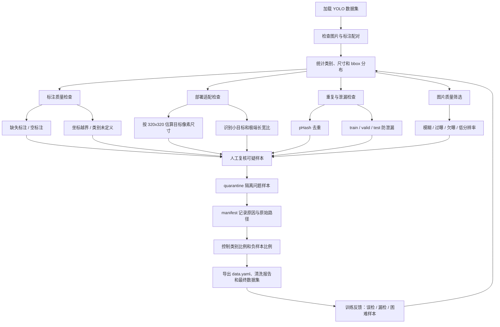

最近在整理室内烟雾火焰检测数据集。这个任务不是简单训练一个 YOLO 模型就结束，后面还有一个更麻烦的限制：模型最终要面向 STM32N647 这类端侧设备，输入按 `320x320` 来考虑。

这个限制一加上去，很多数据问题就变味了。

原图里看得见的火焰，缩到 `320x320` 以后可能只剩几个像素。标注文件为空，也不一定是坏数据，它可能是负样本。重复图片如果同时出现在 train 和 valid 里，指标会好看，但没什么可信度。

我让 Claude Code 写了一个 Streamlit 工具，目录在 `C:\Workspace\stm32n647\数据清洗`。工具本身不复杂，核心模块大概是：

```text
core/loader.py              # 扫描 YOLO 数据集
core/annotation_checker.py  # 查标注问题
core/deploy_checker.py      # 按 320x320 做部署适配检查
core/dedup.py               # pHash 去重
core/quality_checker.py     # 模糊、曝光、分辨率检查
core/split_checker.py       # train/valid/test 防泄漏
core/exporter.py            # 导出报告和 manifest
```

这篇不是介绍工具怎么用，而是借这个小工具复盘一下：**数据集优化到底在优化什么。**

## 先别急着删图

一说数据清洗，很容易想到“把脏数据删掉”。但检测任务里，删图其实是最后一步。

我现在更倾向于先做体检：图片和标注能不能对上？类别 ID 有没有越界？空标注到底是负样本，还是漏标？bbox 缩放后还剩多大？split 之间有没有重复图？

这些问题不搞清楚，直接删图会很危险。删少了，模型继续学脏信号；删多了，可能把有价值的困难样本删掉。

所以这个工具第一步只是扫描和统计。`DatasetLoader` 会记录图片数量、标注数量、空标注数量、类别定义、split 信息，以及每张图片对应的 label 路径。

这一步看起来土，但很必要。数据集结构如果不可信，后面所有图表和训练结果都跟着不可信。

## 空标注最容易误判

这个项目里我最不想自动处理的，是空标注。

YOLO 里空 `.txt` 文件可能代表两件完全不同的事：

- 图片里确实没有火和烟，这是合法负样本；
- 图片里有目标，但没人标，这是漏标。

这两种情况对模型的影响完全相反。

合法负样本有价值。它会告诉模型：灯光、反光、普通室内背景，不要随便报 fire 或 smoke。

漏标就麻烦了。模型会被训练成“这里明明有烟，但标签说没有”。这种样本多了，召回率很容易出问题。

所以 `annotation_checker.py` 里没有把空标注直接删掉，而是先标成 suspicious，留给人工预览。这个地方我觉得应该保守一点。火焰和烟雾本来就受光照、遮挡、透明度影响，纯规则很难一刀切。

## 320x320 会改变样本价值

端侧部署最现实的问题是输入尺寸。

原图是 `1920x1080` 时，一个小烟雾框看起来还能接受；缩放到 `320x320` 后，它可能只剩 `5x4` 像素。这个框不是“错”，但它对轻量模型来说可能已经很难学。

`deploy_checker.py` 做的事情很直接：把 YOLO bbox 按目标输入尺寸换算成像素宽高，然后标出小目标和极端长宽比。

我给火焰和烟雾设了不同的默认阈值：

```text
fire  < 8x8 px
smoke < 12x12 px
```

这个阈值不一定绝对正确，但它提醒我一件事：数据集优化不能只看原图，也要看模型实际吃进去的样子。

如果小目标比例太高，训练结果可能会很难解释。到底是模型不行，还是数据里本来就有大量低信息量目标？这个问题要提前看。

## 去重不是为了洁癖

合并公开数据集、视频帧和网络图片时，重复图很常见。

重复图本身不一定致命，真正危险的是重复图跨 split。比如一张图在 train 里，另一张几乎一样的图在 valid 里，验证指标就会虚高。

工具里用 pHash 做感知哈希，通过汉明距离找重复簇。精确清洗时可以用 `dist = 0`，只处理完全或近乎完全重复的图；做风险排查时可以放宽一点，看有没有相似图跨 split。

这个地方我不想写成“pHash 可以有效去重”这种空话。更准确的说法是：pHash 只能帮我把可疑重复样本捞出来，最后仍然要抽样看图。

尤其是火焰烟雾这种数据，画面相似不代表语义重复。两个房间都有红色火光，pHash 可能接近，但它们未必是同一场景。

## 模糊检测也不能自动全删

`quality_checker.py` 里用了 Laplacian 方差检测模糊，也检查过曝、欠曝和极小分辨率。

这些规则很实用，但我不敢让它们完全自动化。

烟雾本来就低纹理、边界软。Laplacian 分数低，有时说明图片糊了，有时只是说明目标本身就没有清晰边缘。如果阈值太高，可能把真正有价值的烟雾样本删掉。

所以我更喜欢把质量筛选当成“候选问题列表”，不是最终判决。

项目里还写了 `scripts/verify_cleaning.py`，会抽样生成去重对比图和模糊样本图。这个脚本的意义不是炫技，而是提醒自己：清洗质量也需要验证。删掉 1000 张图不代表数据变好了，删对了才算。

## 负样本比例需要设计

火焰烟雾检测不能只喂正样本。没有火、没有烟的图也重要。

但负样本太多，模型可能学得过于保守。它会少误报，但也可能更容易漏报。

在 `scripts/build_final_dataset.py` 里，我对 DFire 的负样本做了二次采样。原始负样本太多时，不全部保留，而是控制一个比例。

这个处理让我意识到，数据集优化不只是“发现错误”。有时你要主动塑造训练分布。

我现在会把样本粗略分成几类看：

- 明确火焰；
- 明确烟雾；
- 火焰和烟雾同时存在；
- 灯光、反光、非火源这类困难负样本；
- 普通背景负样本；
- 标注不确定的可疑样本。

不同类型的比例，会直接影响误报和漏报。这个比单纯追求图片总数更重要。

## 不物理删除，先隔离

数据清洗里我最不喜欢的操作是直接删除。

一旦删错，后面很难追。尤其是数据集经过多轮清洗、合并、重划分之后，如果没有记录，最终数据集是怎么来的都说不清。

所以这个工具采用 `quarantine + manifest`：

- 问题样本先移到 `quarantine/`；
- `manifest.json` 记录原始路径、原因和时间；
- 导出时生成 `clean_report.md`；
- 必要时可以回滚。

这个设计比“删掉坏图”慢一点，但更适合反复迭代。数据集不是一次性产物，它会随着训练结果、误检案例和新数据继续变。

## 我现在认可的流程

如果让我重新整理这个数据集，我会按这个顺序走：



最后那条回路最关键。清洗一次不代表结束。模型训练后的误检、漏检、困难样本，应该继续回到数据侧。

否则数据集优化就会变成凭感觉删图。

## 这类工具的边界

这个工具只能算第一阶段。

它能发现结构问题、标注问题、明显重复、小目标风险和质量风险。但它不能替代模型训练后的误差分析。

pHash 不理解语义。Laplacian 不理解烟雾。空标注是不是漏标，也不能只靠规则判断。小目标阈值更是要结合模型能力和业务容忍度继续调。

所以我现在更愿意把这套工具看成“数据集体检工具”，而不是“自动清洗神器”。

它的价值在于把问题摊开：哪些样本可疑，为什么可疑，删了什么，能不能回滚。只要这些信息清楚，后面训练不好时，才有地方回头查。

## 小结

这次整理数据集之后，我对“数据集优化”的理解变得更具体了。

它不是把脏图删掉，也不是把图片数量堆上去。

它更像是在回答几个工程问题：

```text
数据结构可信吗？
标注会不会误导模型？
缩放到 320x320 后目标还剩多少信息？
验证集指标有没有被泄漏污染？
负样本比例会不会改变模型性格？
每一次清洗能不能复盘？
```

这些问题看起来没有训练参数那么显眼，但它们会直接影响模型最后的表现。

我现在的结论是：模型优化不能只盯着网络结构和训练命令。数据集如果没有被体检、记录和复盘，后面的调参很容易变成玄学。
