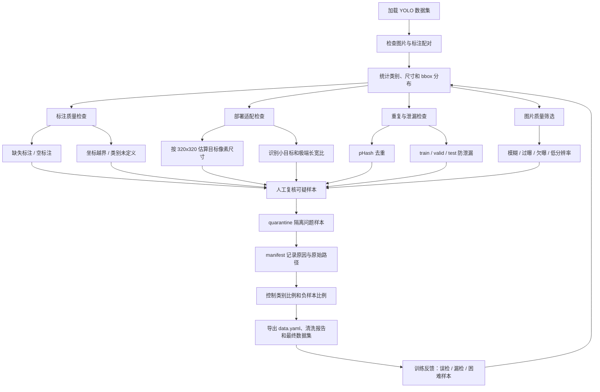

最近在做室内烟雾火焰检测相关的数据集整理，目标是服务一个更具体的部署场景：模型最终要跑在 STM32N647 这类端侧设备上，输入分辨率按 `320x320` 来设计。

这个前提很重要。因为数据集优化不是简单地“图片越多越好”，也不是看到异常样本就全部删掉。真正的问题是：这些数据能不能训练出一个在目标设备、目标输入尺寸、目标场景里稳定工作的模型。

我让 Claude Code 写了一个 YOLO 数据集体检与清洗工具，正好可以借这个工具梳理一下我对数据集优化的理解。

## 数据集优化要先服务目标

如果任务只是云端大模型检测，很多问题可以靠更大的模型、更高的输入分辨率和更强的后处理兜住。但端侧部署不一样。

在 `320x320` 输入下，一个原图里看起来还算明显的火焰框，缩放后可能只剩几个像素。对人眼来说这仍然是火，但对轻量化检测模型来说，它可能已经接近噪声。

所以数据集优化的第一步不是打开文件夹乱删，而是先问清楚几个问题：

- 模型最终检测什么类别？
- 输入分辨率是多少？
- 小目标到什么程度就没有训练价值？
- 负样本比例是否合理？
- train、valid、test 之间有没有泄漏？
- 标注错误会不会误导模型？

这个工具的设计就是围绕这些问题展开的。

## 第一层：先确认数据集结构是可信的

YOLO 数据集表面上很简单，一般就是：

```text
images/
labels/
data.yaml
```

但真实整理数据时，经常会遇到各种小问题：图片存在但没有标注文件，标注文件为空，类别 ID 和 `data.yaml` 对不上，图片分布在 `train/valid/test` 的不同目录里，甚至不同来源的数据集目录结构完全不一致。

工具里的 `DatasetLoader` 做的第一件事，就是扫描图片和标注的配对关系，并缓存数据集基本信息。它关注的是最基础但很关键的事实：

- 一共有多少张图片；
- 有多少个标注文件；
- 有多少空标注；
- 类别定义是什么；
- 有哪些 split；
- 每张图片对应哪个标注文件。

这些听起来很普通，但如果这一步不可靠，后面的统计、清洗和训练都会建立在错误基础上。

## 第二层：标注质量比图片数量更重要

检测任务里，标注错误的危害很直接。模型不是只从图片中学习，它还会从标注框的位置、大小和类别中学习。

工具的标注检查主要覆盖几类问题：

- 标注文件缺失；
- 空标注文件；
- 坐标越界；
- bbox 面积过小或过大；
- 类别 ID 未定义。

其中最值得单独讨论的是空标注。

空标注不一定是坏数据。如果图片里确实没有火焰和烟雾，它就是合法负样本。负样本能告诉模型：不是所有亮光、墙面、灯具、窗户反光都应该被识别成火。

但空标注也可能是漏标。图片里明明有烟雾，标注文件却是空的，这种样本会给模型传递错误信号：这里没有目标。

所以空标注不能简单等同于“删除”。更合理的做法是把它分成：

- 合法负样本；
- 可疑漏标；
- 缺失标注文件。

工具目前对空标注默认标记为 suspicious，再交给人工预览确认。这个策略比自动删除更稳，因为火焰和烟雾这类目标本身就容易受光照、遮挡和透明度影响。

## 第三层：按部署分辨率重新看目标大小

很多数据集在原始分辨率下看起来没问题，但缩放到端侧输入后问题才暴露出来。

比如原图是 `1920x1080`，某个烟雾框宽高只有原图的一小部分。训练前如果只看归一化坐标，很容易忽略它实际缩放后的像素大小。

工具里的部署检查会把 bbox 按 `320x320` 的目标输入估算成像素尺寸，然后检查：

- 火焰框是否小于阈值；
- 烟雾框是否小于阈值；
- 是否存在极端长宽比；
- 图片宽高比和方形输入差距是否过大。

这里的思路是：数据集不只是要“标得对”，还要“适合目标模型学”。

如果大量目标缩放后只剩 `4x4` 或 `6x6` 像素，那么它们很可能会变成困难样本。困难样本不是不能要，但比例太高会拖累训练，也会让评估结果变得很难解释。

对端侧检测来说，数据优化必须和输入尺寸绑定起来看。

## 第四层：去重和 split 防泄漏

图像检测数据集里很容易出现重复图片，尤其是从多个公开数据集、视频帧、网络图片里合并数据时。

重复数据有两个问题。

第一，它会让数据分布失真。如果某一类场景被重复采样很多次，模型会过度记住这些画面。

第二，它可能造成 train 和 valid/test 之间的数据泄漏。如果同一张图或高度相似的图同时出现在训练集和验证集，验证指标就会虚高。

工具里用 pHash 做感知哈希，通过汉明距离找重复或近似重复图片。设计上分了两种用法：

- 精确去重时使用更严格阈值，比如 `dist = 0`；
- 体检和风险提示时可以放宽阈值，找近似重复簇。

对比赛或项目汇报来说，split 防泄漏尤其重要。一个模型如果在泄漏数据上拿到高指标，实际上没有太多说服力。

## 第五层：图片质量筛选不能只看“清晰不清晰”

工具里也做了图片质量检查，包括：

- Laplacian 方差检测模糊；
- 亮度比例检测过曝和欠曝；
- 图片分辨率过小检查。

这些规则很实用，但也要知道它们的边界。

比如 Laplacian 方差低，通常说明图片边缘信息少，可能是模糊图。但烟雾本身就是低纹理、边界不清晰的目标。如果阈值太激进，可能把一些真实烟雾样本误删。

所以图片质量筛选不能完全自动化。我的理解是：规则负责把可疑样本找出来，最终是否删除，要结合任务语义和抽样预览判断。

这个工具里有验证脚本，会抽样生成去重对比图和模糊样本图，让人检查是否误删。这一点很关键，因为数据集清洗本质上不是追求“删得多”，而是追求“删得准”。

## 第六层：负样本比例也需要设计

火焰烟雾检测不是只需要正样本。没有火、没有烟的图片同样重要。

问题在于负样本比例不能失控。如果一个数据集里负样本太多，模型可能学到一个很保守的策略：尽量不报目标。这样误报少了，但漏报可能变多。

构建最终数据集的脚本里有一个有意思的处理：对 DFire 里的负样本做二次采样，把负样本比例控制下来，而不是全部保留。

这说明数据集优化不只是“清理错误”，还包括主动塑造训练分布。

对于这个任务，我觉得可以把样本分成几类看：

- 明确火焰样本；
- 明确烟雾样本；
- 火焰和烟雾同时存在的样本；
- 灯光、反光、非火源等困难负样本；
- 普通背景负样本；
- 标注不确定的可疑样本。

不同类型的比例会直接影响模型的召回率和误报率。

## 第七层：不要物理删除，先隔离

数据清洗里最危险的操作是直接删除。

因为一旦删错，后面很难知道发生了什么。尤其是数据集经过多轮清洗、合并、重划分之后，如果没有记录，很难复现最终数据集是怎么来的。

这个工具采用的是 `quarantine + manifest` 思路：

- 可疑或要移除的文件先移动到 `quarantine/`；
- `manifest.json` 记录原始路径、操作原因和时间；
- 导出时生成清洗报告；
- 需要时可以回滚。

这个设计比“删掉所有坏图”更适合长期迭代。数据集不是一次性产物，而是会随着训练结果、误检案例和新数据不断更新。

## 一个更合理的数据优化流程

结合这个工具，我觉得一个 YOLO 数据集优化流程可以这样走：



这里面最核心的不是某个具体算法，而是把数据集变成一个可解释、可追溯、可复盘的工程对象。

这个流程里我最看重的是最后一条回路：数据集不是清洗一次就结束，而是要把训练后的误检、漏检和困难样本继续送回数据侧。这样每一轮优化都有依据，而不是凭感觉删图、加图。

## 这类工具的局限

规则工具能发现很多低级问题，但不能替代模型训练后的误差分析。

比如：

- pHash 只能发现视觉相似，不能理解语义重复；
- Laplacian 模糊检测可能误伤烟雾样本；
- 空标注是否漏标，需要人工或模型辅助判断；
- 小目标阈值要根据模型能力和业务需求调整；
- 类别比例是否合理，最终要看训练曲线和验证集表现。

所以我更愿意把这个工具看成数据集优化的第一阶段：它负责把明显不可信、不适配、不易追溯的问题先暴露出来。真正的第二阶段，应该结合训练后的误检、漏检和困难样本继续迭代。

## 小结

数据集优化不只是清洗脏数据。对端侧目标检测来说，它至少包括四层含义：

第一，保证结构和标注可信。

第二，让数据分布服务目标任务，而不是盲目堆数据。

第三，按部署条件重新评估样本价值，比如 `320x320` 下的小目标问题。

第四，让每次修改都可追溯、可回滚、可复现。

这也是我觉得这类工具有价值的地方：它不是替代人判断，而是把人的判断前置到更清晰的证据上。数据集一旦能被体检、记录和复盘，后面的模型优化才不会变成玄学。
