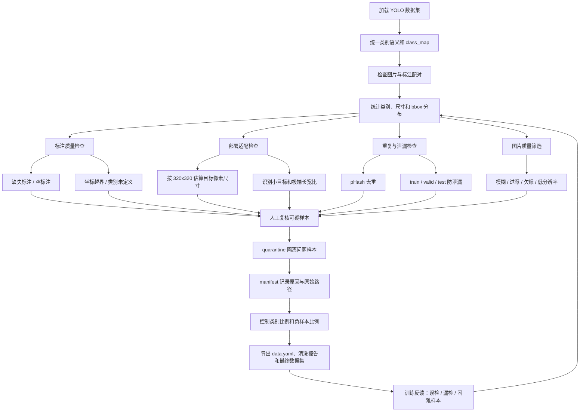

最近在整理室内烟雾火焰检测数据集。这个任务表面上是“训练一个 YOLO 检测器”，但真正开始做以后，我发现麻烦点不在训练命令，而在数据本身。

目标设备按 STM32N647 这类端侧场景考虑，输入尺寸先按 `320x320`。这个限制一加上去，很多判断都会变：原图里看得见的烟，缩到 `320x320` 后可能只剩几像素；空标注不一定是坏数据，也可能是负样本；重复图如果跨 train/valid，指标会变好看，但没什么可信度。

我让 Claude Code 写了一个 Streamlit 工具，目录在：

```text
C:\Workspace\stm32n647\数据清洗
```

这篇不是工具使用说明。我更想记录的是：做完这个工具后，我对“数据集优化”这件事的理解变了。它不是把脏图删掉，而是让每一次数据改动都有理由、能回滚、能解释训练结果。

## 这次的数据不是一个来源

`configs/build_config.yaml` 里现在合了三份数据：

```text
室内火灾数据集
DFireDataset
q238 Indoor Fire
```

它们的类别定义并不完全一致，所以第一步不是训练，而是统一语义。

配置里把目标类别收敛成两个：

```text
fire  -> class 0
smoke -> class 1
```

几个映射也很具体：

```text
室内火灾数据集: FiRE-indoor -> fire
DFireDataset: smoke -> smoke, fire -> fire
q238 Indoor Fire: fire -> fire
```

这个地方很容易被忽略。数据集一多，类别名看起来差不多，但 ID、含义、负样本规则可能都不一样。如果这里没处理干净，后面训练出来的模型会学到一堆混乱信号。

## 先体检，不急着删

一说数据清洗，很容易想到“删掉坏图”。但检测任务里，删图其实应该放到后面。

我现在会先问这些问题：

- 图片和标注能不能对上；
- 类别 ID 有没有越界；
- 空标注是合法负样本，还是漏标；
- bbox 缩到 `320x320` 后还剩多大；
- train、valid、test 之间有没有相似图泄漏；
- 负样本是不是多到稀释训练信号。

工具里的核心模块就是围绕这些问题写的：

```text
core/loader.py              # 扫描 YOLO 数据集
core/annotation_checker.py  # 查标注问题
core/deploy_checker.py      # 按 320x320 做部署适配检查
core/dedup.py               # pHash 去重
core/quality_checker.py     # 模糊、曝光、分辨率检查
core/split_checker.py       # train/valid/test 防泄漏
core/exporter.py            # 导出报告和 manifest
```

`loader.py` 做的事情看起来很基础：统计图片数量、标注数量、空标注数量、类别定义、split 信息，以及每张图片对应的 label 路径。但我现在觉得这一步不能省。

数据集结构如果不可信，后面所有图表和训练结果都不可信。

## 空标注不能一刀切

YOLO 里空 `.txt` 文件可能代表两件完全不同的事：

- 图片里确实没有火和烟，这是合法负样本；
- 图片里有目标，但没人标，这是漏标。

这两种情况对模型的影响是反的。

合法负样本有价值。它会告诉模型：普通室内背景、灯光、反光、红色物体，不要随便报 fire 或 smoke。

漏标就麻烦。模型会被训练成“这里明明有烟，但标签说没有”。这种样本多了，召回率很容易出问题。

所以 `annotation_checker.py` 没有把空标注直接删掉，而是先标成 suspicious，留给人工预览。这个地方我不想装作纯规则能解决。火焰和烟雾受光照、遮挡、透明度影响太大，很多边界样本只能人看。

## 320x320 会重新定义小目标

端侧部署最现实的问题是输入尺寸。

一张 `1920x1080` 原图里的小烟雾框，看原图可能还行；缩到 `320x320` 后，它可能只剩 `5x4` 像素。这个框不是错，但它对轻量模型来说可能已经接近低信息量目标。

`deploy_checker.py` 做的事情很直接：把 YOLO bbox 按目标输入尺寸换算成像素宽高，然后标出小目标和极端长宽比。

我给火焰和烟雾用了不同阈值：

```text
fire  < 8x8 px
smoke < 12x12 px
```

这个阈值不是标准答案。它只是提醒我：数据集优化不能只看原图，也要看模型实际吃进去的样子。

如果训练后小烟雾漏检严重，我就不会只去怀疑网络结构。我要先回头看：数据里是不是本来就有大量缩放后只剩几个像素的目标？这些目标在训练集、验证集里的比例是不是一致？

## 去重最怕跨 split

合并公开数据集、视频帧和网络图片时，重复图很常见。

重复图本身不一定致命。真正危险的是重复图跨 split。比如一张图在 train 里，另一张几乎一样的图在 valid 里，验证指标就会虚高。

工具里用 pHash 做感知哈希。当前配置比较保守：

```text
phash_hamming: 0
```

也就是先只抓完全或近乎完全重复的图。以后如果要扩大排查，可以放宽汉明距离，但我不会直接让它自动删除。

pHash 不理解语义。两个火灾画面可能视觉上很像，但不是同一张图；两个视频帧也可能只差一点点，但放在不同 split 里就会污染验证结果。这个地方更适合“捞出可疑样本”，不是“自动判死刑”。

## 模糊检测对烟雾不友好

`quality_checker.py` 里用了 Laplacian 方差检测模糊，也会检查过曝、欠曝和极小分辨率。

配置里的默认值是：

```text
blur_threshold: 50.0
```

这个数可以作为起点，但不能当裁判。

烟雾本来就低纹理、边界软。Laplacian 分数低，有时说明图片糊了，有时只是说明目标本身没有清晰边缘。如果阈值设得太硬，可能会把真正有价值的烟雾样本删掉。

所以我更愿意把质量检查当成候选问题列表。工具可以帮我排序、筛选、预览，但最后要不要动数据，还是要看样本本身。

## 负样本比例也要设计

火焰烟雾检测不能只喂正样本。没有火、没有烟的图也重要。

但负样本太多，模型可能学得过于保守：误报少了，漏报可能上来。

配置里对 DFire 的负样本做了保留比例控制：

```text
dfire_neg_keep_ratio: 0.33
```

这个设置不是为了“清洗掉负样本”，而是避免某个数据源里的负样本把训练分布压歪。

我现在会把样本粗略分成几类看：

- 明确火焰；
- 明确烟雾；
- 火焰和烟雾同时存在；
- 灯光、反光、红色物体这类困难负样本；
- 普通背景负样本；
- 标注不确定的可疑样本。

这些比例会影响模型性格。只看图片总数没用，数据分布才决定模型会偏向“爱报警”还是“很保守”。

## 我不想直接删除文件

数据清洗里我最不喜欢的操作是直接删除。

一旦删错，后面很难追。尤其是数据集经过多轮清洗、合并、重划分之后，如果没有记录，最终数据集是怎么来的都说不清。

所以工具采用 `quarantine + manifest`：

- 问题样本先移到 `quarantine/`；
- `manifest.json` 记录原始路径、原因和时间；
- 导出时生成 `clean_report.md`；
- 必要时可以回滚。

这个设计慢一点，但更适合反复迭代。数据集不是一次性产物，它会随着训练结果、误检案例和新数据继续变。

## 最后导出也要可复现

配置里固定了划分比例和随机种子：

```text
train_ratio: 0.8
val_ratio: 0.1
random_seed: 42
```

`test_ratio` 按剩余比例算，也就是 `0.1`。

这个细节看起来小，但很关键。数据集清洗之后，如果划分每次都变，那训练结果变好到底是模型改了，还是数据 split 变了，就很难说清楚。

我更希望最后导出的东西像一次实验材料，而不是一个临时文件夹：

```text
data.yaml
manifest.json
clean_report.md
removed_or_quarantined.csv
config.yaml
```

只要这些文件还在，后面复盘时至少能回答：用了哪些数据，删了什么，为什么删，类别怎么映射，随机种子是多少。

## 我现在认可的流程

如果让我重新整理这个数据集，我会按这个顺序走：


```mermaid
flowchart TD
    A["加载 YOLO 数据集"] --> B["统一类别语义和 class_map"]
    B --> C["检查图片与标注配对"]
    C --> D["统计类别、尺寸和 bbox 分布"]
    D --> E["标注质量检查"]
    E --> E1["缺失标注 / 空标注"]
    E --> E2["坐标越界 / 类别未定义"]
    D --> F["部署适配检查"]
    F --> F1["按 320x320 估算目标像素尺寸"]
    F --> F2["识别小目标和极端长宽比"]
    D --> G["重复与泄漏检查"]
    G --> G1["pHash 去重"]
    G --> G2["train / valid / test 防泄漏"]
    D --> H["图片质量筛选"]
    H --> H1["模糊 / 过曝 / 欠曝 / 低分辨率"]
    E1 --> I["人工复核可疑样本"]
    E2 --> I
    F1 --> I
    F2 --> I
    G1 --> I
    G2 --> I
    H1 --> I
    I --> J["quarantine 隔离问题样本"]
    J --> K["manifest 记录原因与原始路径"]
    K --> L["控制类别比例和负样本比例"]
    L --> M["导出 data.yaml、清洗报告和最终数据集"]
    M --> N["训练反馈：误检 / 漏检 / 困难样本"]
    N --> D
```

最后那条回路最关键。清洗一次不代表结束。模型训练后的误检、漏检、困难样本，应该继续回到数据侧。

否则数据集优化就会变成凭感觉删图。

## 这套工具的边界

这个工具只能算第一阶段。

它能发现结构问题、标注问题、明显重复、小目标风险和质量风险。但它不能替代模型训练后的误差分析。

pHash 不理解语义。Laplacian 不理解烟雾。空标注是不是漏标，也不能只靠规则判断。小目标阈值更是要结合模型能力和业务容忍度继续调。

下一步如果要继续做，我更想接入模型辅助分析：把训练后的误检、漏检、低置信度样本重新拉回数据工具里看。那时候数据清洗才不是一次性脚本，而是训练闭环的一部分。

## 小结

这次整理数据集之后，我对“数据集优化”的理解变得更具体了。

它不是把脏图删掉，也不是把图片数量堆上去。

它更像是在回答几个工程问题：

```text
类别语义统一了吗？
标注会不会误导模型？
缩放到 320x320 后目标还剩多少信息？
验证集指标有没有被泄漏污染？
负样本比例会不会改变模型性格？
每一次清洗能不能复盘？
```

这些问题没有训练参数那么显眼，但它们会直接影响模型最后的表现。

我现在的结论是：模型优化不能只盯着网络结构和训练命令。数据集如果没有被体检、记录和复盘，后面的调参很容易变成玄学。
