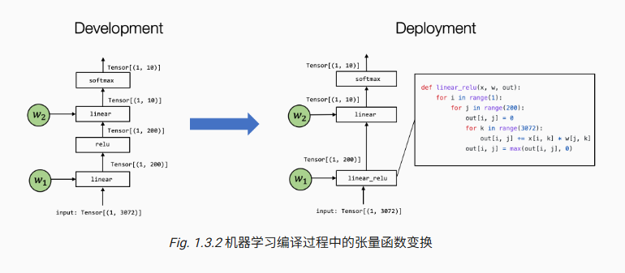

最近开始看陈天奇老师团队的 MLC 课程。第一章主要回答一个问题：机器学习编译到底在做什么，为什么它会成为机器学习系统里绕不开的一层。

这篇先整理课程导论里的核心概念，后面再逐章补张量程序抽象、自动程序优化、GPU 加速和计算图优化这些内容。

## 从开发形式到部署形式

我们平时训练或调试模型时，通常面对的是“开发形式”：比如用 PyTorch、TensorFlow 或 JAX 写出来的模型代码，以及模型训练得到的权重。这个形式适合研究、调试和快速迭代，但不一定适合直接放到手机、浏览器、车载设备、云端服务或专用芯片上运行。

真正上线时，需要的是“部署形式”：它不仅包括模型计算本身，还包括运行所需的库、内存管理、硬件调用、应用接口，以及和具体系统环境配套的执行方式。

机器学习编译做的事情，就是把开发阶段的模型，通过一系列变换和优化，转换成更适合目标环境运行的部署形态。

## 为什么叫“编译”

传统编译器会把高级语言代码转换成机器可以执行的程序。机器学习编译也有类似的味道：输入是高层模型描述，输出是可以部署和执行的模型程序或运行库。

不过 MLC 和传统编译并不完全一样。它不一定每次都生成底层机器码，有时只是把模型转换成对已有高性能库的调用；有时会做算子融合、图优化、内存优化；有时还会针对 GPU、NPU、TensorCore 等硬件特性生成更合适的实现。

所以 MLC 更像是一套面向机器学习部署的系统方法：在模型表达、计算图、张量程序和硬件实现之间不断做抽象转换。

## 机器学习编译的三个目标

课程里把 MLC 的目标概括成三类。

第一是集成与最小化依赖。部署一个模型时，我们只想带上真正需要的计算和运行组件，而不是把整个训练框架都塞进应用里。这样可以减小体积，也能让模型更容易部署到资源受限的设备上。

第二是利用硬件加速。不同环境有不同的硬件能力：CPU、GPU、移动端 NPU、云端加速器，甚至专用 AI 芯片。MLC 需要把模型计算映射到这些硬件擅长的执行方式上，例如调用原生加速库，或者生成能利用特殊指令的底层程序。

第三是通用优化。同一个模型可以有多种等价执行方式，但不同写法的性能差距可能很大。MLC 会通过计算图优化、算子融合、内存复用、调度优化等方式，让模型跑得更快，占用更少资源。

这三个目标之间不是完全分开的。比如算子融合既可以减少依赖和运行开销，也可能带来更好的硬件利用率。

## 张量和张量函数

理解 MLC 的关键，是先把模型执行看成张量之间的计算。

张量是模型中的输入、输出和中间结果，本质上是多维数组。图片、文本特征、隐藏层状态、权重矩阵，最后都可以落到张量这个统一表示上。

张量函数则描述张量之间如何计算。一个线性层、一个 ReLU、一个 Softmax 都可以看成张量函数；多个算子组合起来的一段计算，甚至整个模型，也可以看成更大的张量函数。

MLC 做优化时，经常不是只盯着单个算子，而是看一组张量函数之间能不能被重写、融合或映射到更高效的实现。

上图展示了一个典型例子：开发阶段的模型里，`linear` 和 `relu` 是两个独立计算；部署时可以把它们融合成一个 `linear_relu`。这样可以减少中间张量的读写，也给后端实现留下更多优化空间。

这就是我理解里的“图级算子融合”：它不是改变模型数学意义，而是在保持结果等价的前提下，换一种更适合执行的计算组织方式。

## 抽象与实现

第一章里很重要的一句话是：抽象描述“做什么”，实现描述“怎么做”。

在机器学习系统里，同一个张量函数可以有很多层表示：它可以是计算图中的一个节点，也可以是循环嵌套，也可以是调用某个库函数，还可以是生成出来的一段 GPU kernel。

MLC 的核心工作，就是在这些抽象层之间做转换。高层抽象方便表达模型，低层实现负责贴近硬件。编译器要做的是在不改变语义的前提下，找到更高效、更适合部署环境的实现。

这也是为什么机器学习编译不只是“让模型快一点”。它实际上连接了模型、框架、运行时、硬件和应用部署。

## 为什么要学 MLC

对机器学习工程师来说，MLC 能帮助我们理解模型从训练代码走向生产环境的过程。当模型部署变慢、占内存过大，或者目标平台不被主流框架很好支持时，只会调模型结构是不够的，还需要理解底层执行链路。

对算法同学来说，MLC 可以解释为什么同一个模型在不同平台上性能差别很大，也能帮助我们判断一个模型结构是否适合真实部署。

对硬件和系统方向来说，MLC 提供了一套把新硬件能力接入机器学习生态的方法。模型越来越大，硬件越来越多样，靠手写适配很难长期维护，编译和自动优化会越来越重要。

## 小结

MLC 第一章可以概括成一句话：机器学习编译研究的是如何把开发阶段的机器学习模型，转换成适合具体环境部署和高效执行的形式。

它关心的不只是模型本身，还包括依赖裁剪、硬件加速、计算图优化、张量程序变换和运行时集成。后面的课程，其实就是沿着这些问题继续往下拆。

参考资料：[《机器学习编译》中文课程导论](https://book-zh.mlc.ai/chapter_introduction/index.html)
